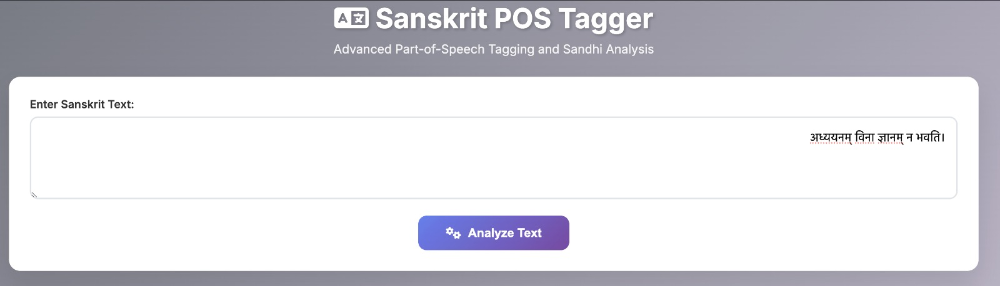

<div align="center">
	
</div>

# Sanskrit Sandhi + POS Tagger

This repository contains scripts and models for Sanskrit Sandhi splitting and Part-of-Speech (POS) tagging.

Contents
- `simple_app.py` — minimal demo script to run the integrated processor.
- `src/` — core modules: tokenizer, model wrappers, and training scripts.
- `data/` — dataset loaders and sample data files.
- `models/` — trained model weights (large files excluded from git in `.gitignore`).

Prerequisites
- Python 3.8+ (test with `python --version`)
- Install dependencies from `requirements.txt`:

```bash
python -m pip install -r requirements.txt
```

Quickstart / Usage

1) Run the demo app:

```bash
cd "/Users/himanshukumar/Documents/sanskrit-pos-tagger 2"
python simple_app.py
```

2) Use the `integrated_sanskrit_processor` from `src` in your own code:

```python
from src.integrated_sanskrit_processor import IntegratedSanskritProcessor

proc = IntegratedSanskritProcessor()
text = "अहं गच्छामि"
result = proc.process(text)
print(result)
```

Development / Training
- Training scripts are available under `src/` (for example `train_bilstm_sandhi.py`). Review those files to run training.

Notes
- The `models/` directory may contain large pre-trained weights (e.g., `.pt` files); these are ignored by `.gitignore`.
- If you want CI, tests, or a license added, open an issue or request it here and I'll add them.

License
- Add a license file if you want this repository to be explicitly licensed.

Contact
- For questions, patch suggestions, or issues, please file an issue on the GitHub repository.

## Pipeline Flowchart

The full pipeline flowchart (click to view full size):

<div align="center">
	<a href="img/Sanskrit%20NLP%20Pipeline%20Flowchart.png">
		
	</a>
</div>
# sanskrit-sandhi-pos-tagger